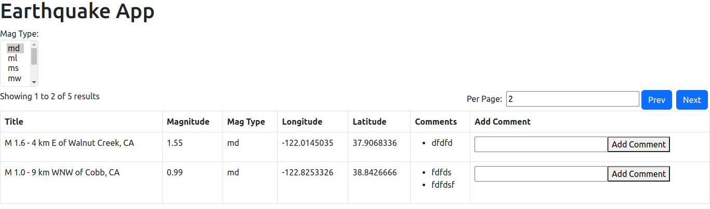

# Frogmi frontend

## Descripción

El frontend está desarrollado en React y utiliza una tabla con paginación y filtro por `mag_type`.

### Funcionalidades

- **Paginación**: Permite navegar entre las páginas de resultados.
- **Filtro por mag_type**: Permite filtrar los resultados por tipo de magnitud.

### Tecnologías Utilizadas

- React
- Bootstrap

## Captura de Pantalla

